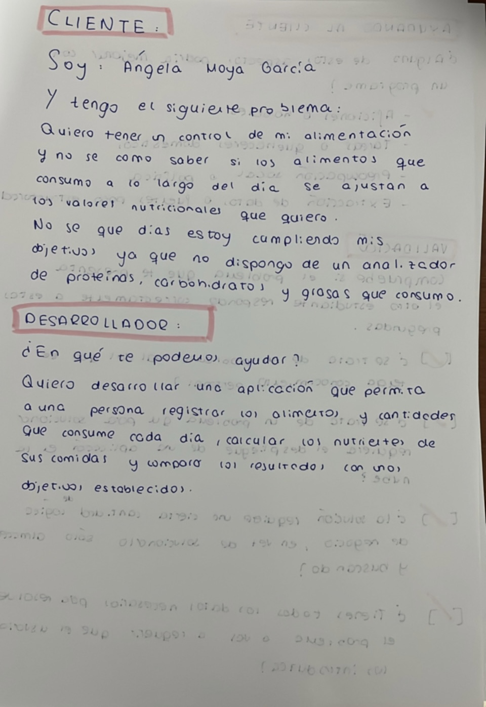
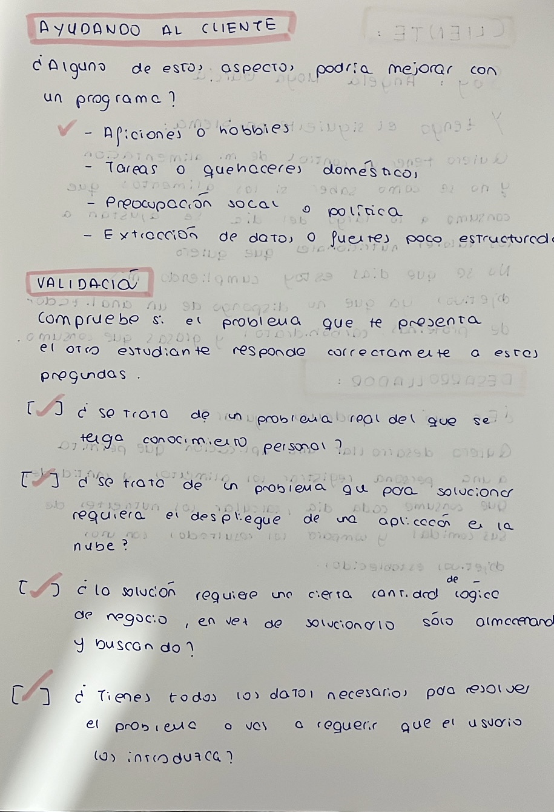

# Análisis nutriconal

## Problema
Una persona que tiene unos objetivos nutricionales quiere poder tener un control de las comidas que hace de forma que pueda ver si cumple sus objetivos diarios (cantidad de proteína, carbohidratos y grasas). 

## Contexto
Somos muchos a los que a día de hoy nos gusta cuidar nuestra alimentación para sentirnos mejor y favorecer nuestra salud. Pero muchas veces no tenemos la suficiente información sobre como hacer nuestra propia dieta equilibrada, ya que desconocemos los nutrientes que tienen los alimentos que consumimos.

## Datos disponibles
Una persona va seleccionando diariamente que alimentos consume en cada comida y así calculamos valor nutricional de lo que come a lo largo del día y se compara con los objetivos que quiere cumplir.

## Lógica del problema
Se hace una comparación de los nutrientes consumidos con los objetivos y se detecta que días se alejan de los objetivos dando un análisis detallado.

## Role-play

## Configuración del repositorio 
